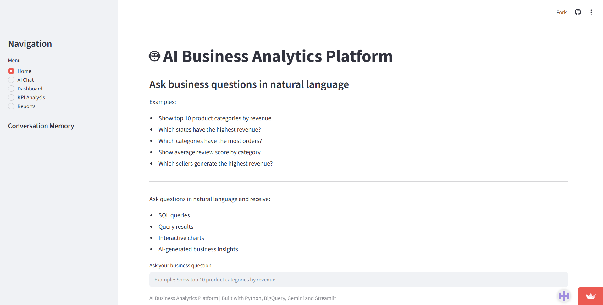
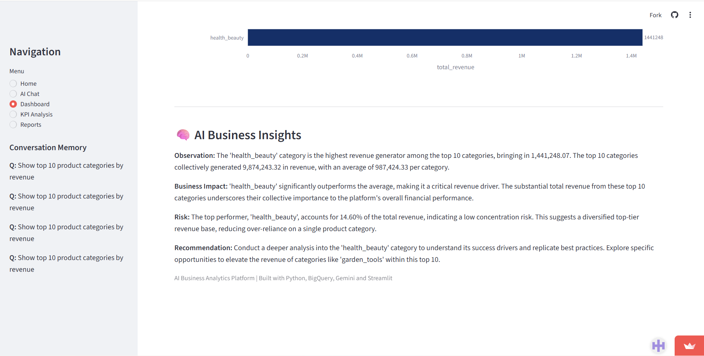
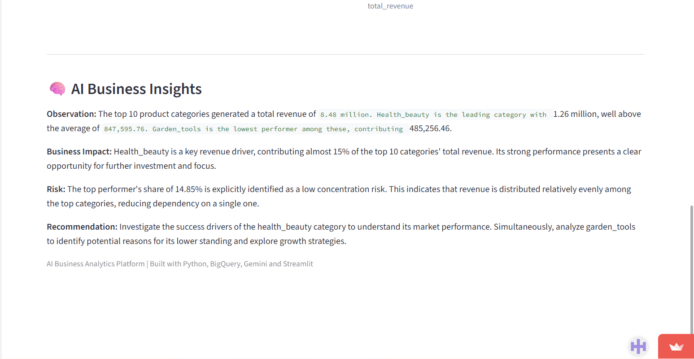
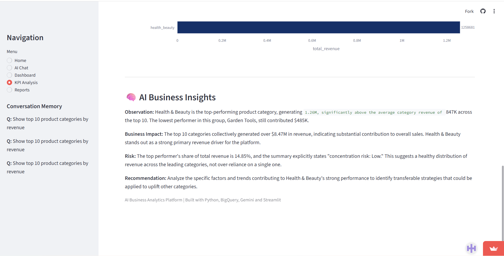
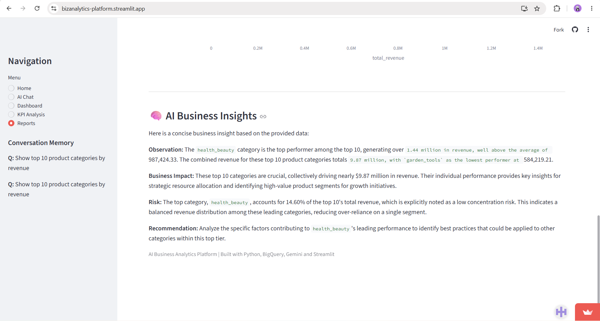
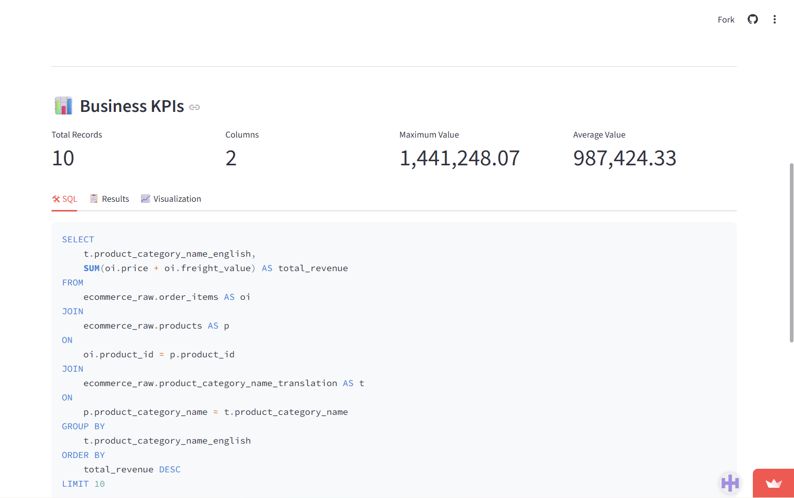
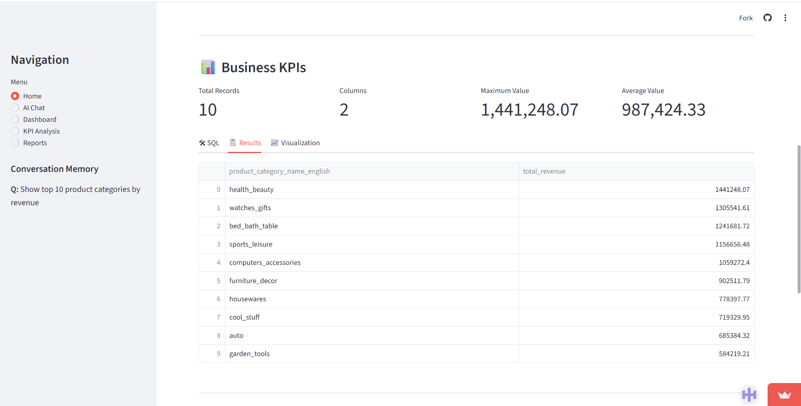

# 🤖 AI-Powered Business Analytics Platform

<p align="center">


</p>

---

## 🌐 Live Demo

### 🔗 https://bizanalytics-platform.streamlit.app/

> **Note**
>
> Since the application is hosted on Streamlit Community Cloud, it may take around **20–60 seconds** to wake up after a period of inactivity.

---

# 📖 Overview

The AI-Powered Business Analytics Platform is an intelligent analytics application built using **Python**, **Streamlit**, **Google BigQuery**, and **Google Gemini AI**.

The platform enables users to analyze business data through interactive dashboards, AI-generated insights, and natural language queries.

Instead of manually writing SQL queries or preparing reports, users can explore KPIs and obtain meaningful business insights through an intuitive interface.

The application has also been containerized using Docker, making it portable and easy to deploy across different environments.

---

# ✨ Key Features

- Interactive Business Dashboard
- AI-powered Business Assistant
- KPI Analysis
- Executive Business Reports
- Natural Language Business Queries
- Google BigQuery Integration
- Interactive Plotly Visualizations
- Dockerized Deployment
- Cloud Ready

---

# 📸 Application Preview

<h3 align="center">Home & Dashboard</h3>

<p align="center">


</p>

---

<h3 align="center">AI Chat & KPI Analysis</h3>

<p align="center">


</p>

---

<h3 align="center">Reports</h3>

<p align="center">

     
</p>

---
<h3 align="center"> SQL Query & Result Table</h3>

<p align="center">


 </p>
---

# 🏗 System Architecture

```
                   User

                     │

                     ▼

             Streamlit Dashboard

          ┌──────────┴──────────┐

          │                     │

          ▼                     ▼

   Gemini AI Module      BigQuery Module

          │                     │

          ▼                     ▼

 Google Gemini API     Google BigQuery

          │                     │

          └──────────┬──────────┘

                     │

                     ▼

      Business Insights & Charts
```

---

# 💻 Technology Stack

| Category | Technology |
|------------|------------|
| Language | Python |
| Frontend | Streamlit |
| AI | Google Gemini API |
| Database | Google BigQuery |
| Visualization | Plotly |
| Data Processing | Pandas, NumPy |
| Cloud | Google Cloud Platform |
| Containerization | Docker & Docker Compose |
| Version Control | Git & GitHub |

---

# 📂 Project Structure

```
bizanalytics-platform/

│

├── ai_dashboard.py

├── ai_query.py

├── ai_insights.py

├── charts.py

├── config.py

├── executive_summary.py

├── text_to_sql.py

├── prompts.py

├── Dockerfile

├── docker-compose.yml

├── requirements.txt

├── .dockerignore

├── credentials/

├── images/

├── data/

├── dbt_project/

└── README.md
```

---

# ⚙ How It Works

1. User interacts with the Streamlit interface.
2. Business data is fetched from Google BigQuery.
3. Gemini AI processes business-related questions.
4. Plotly generates interactive charts.
5. AI-generated insights are displayed to the user.

---

# 🐳 Running with Docker

Clone the repository

```bash
git clone https://github.com/your-username/bizanalytics-platform.git

cd bizanalytics-platform
```

Build Docker Image

```bash
docker compose build
```

Start the Application

```bash
docker compose up
```

Visit

```
http://localhost:8501
```

Stop

```bash
docker compose down
```

---

# ▶ Running Locally

Install Dependencies

```bash
pip install -r requirements.txt
```

Run Streamlit

```bash
streamlit run ai_dashboard.py
```

---

# 🔐 Configuration

To run the project locally, configure the following before starting the application:

- Google Gemini API key
- Google Cloud Project with BigQuery enabled
- Google Cloud Service Account JSON key

These values should be stored locally and **must not** be committed to GitHub.

---

# 🚀 Future Enhancements

- User Authentication
- Role-Based Access Control
- Predictive Analytics
- Forecasting Models
- Docker Multi-stage Build
- Kubernetes Deployment
- CI/CD Pipeline
- Automated Reporting

---

# 📚 Learning Outcomes

This project helped me gain hands-on experience with:

- Business Analytics
- Google BigQuery
- Streamlit
- Docker
- Docker Compose
- Prompt Engineering
- Google Gemini API
- Cloud Integration
- Interactive Dashboard Development
- End-to-End Project Deployment

---

# 👨‍💻 Author

**Piyush Bande**

### Live Demo

https://bizanalytics-platform.streamlit.app/

### GitHub

https://github.com/Piyush-Code13/bizanalytics-platform

### LinkedIn

https://www.linkedin.com/in/piyushbande

---

# 📄 License

This project is shared for educational and portfolio purposes.
